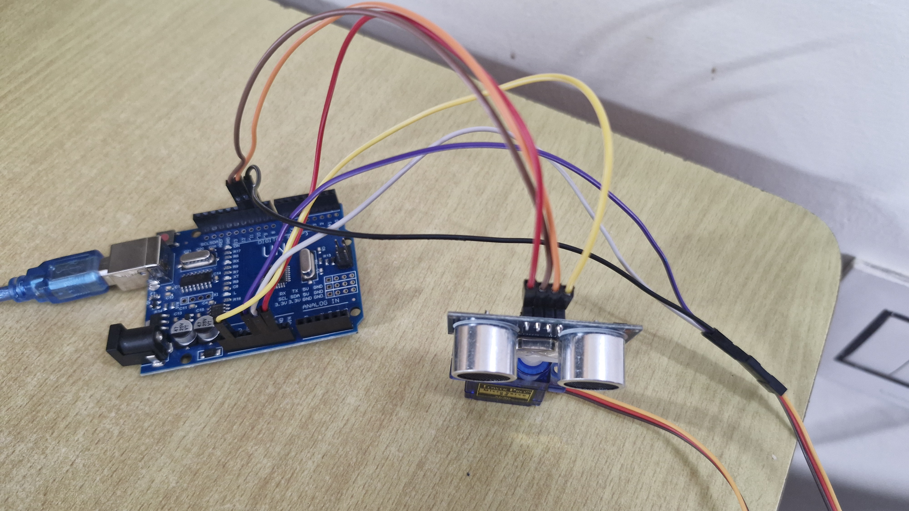
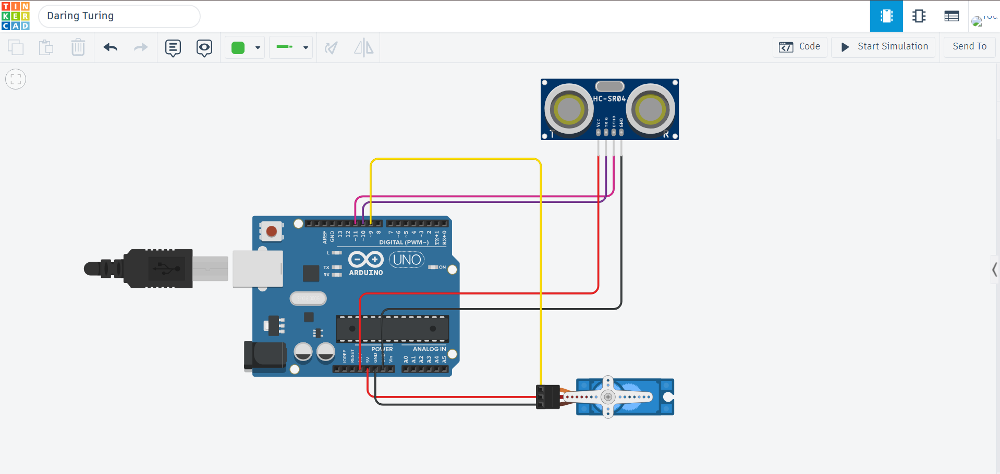

# Ultrasonic Object Scanner
An Arduino based scanning system that uses an ultrasonic sensor mounted on a servo motor to sweep a field of view and report distance, a proximity category and an apparent speed value at each angle.

## Overview
This project interfaces with an HC-SR04 ultrasonic sensor with a SG90 servo motor, controlled by an Arduino Uno. the servo sweeps across a fixed angular range while the sensor measures distance at each step using pulse-echo timing, producing an angular distance map - the same core time-of-flight ranging principle used in radar and lidar systems, applied here at a small, accessible scale. 

## Components
| Component | Purpose |
|---|---|
| Arduino Uno | Microcontroller - controls servo, reads sensor, runs detection logic |
| HC-SR04 Ultrasonic Sensor | Emits ultrasonic pulse, measures echo return time |
| SG90 Servo Motor | Sweeps sensor across the scan angle |
| Jumper wires | Circuit connections |

## Hardware Setup




## Circuit Diagram

| Component | Pin | Arduino Pin |
|---|---|---|
| Servo | Signal | D9 |
| HC-SR04 | TRIG | D10 |
| HC-SR04 | ECHO | D11 |
| HC-SR04 & Servo | VCC | 5V |
| HC-SR04 & Servo | GND | GND |

## How It Works
1. The servo sweeps from 0 degrees to 180 degrees in 5 degree steps, then back, continuously.
2. At each scan step, the ultrasonic sensor emits a pulse and measures echo return time.
3. **Distance:** It is calculated from echo time using speed of sound: 'distance = (duration x 0.0343) / 2'.
4. **Proximity Category:** Here (NEAR/MID/FAR) is assigned from distance thresholds - under 20cm is NEAR, under 50cm is MID and anything above is FAR. 
5. **Apparent Speed:** It is calculated from change in distance between successive scan steps, divided by the time between them. Because each step is at a different angle, this is not the true velocity of a moving object.
6. **No Echo:** If no echo is received within 30ms timeout, the reading is marked 'NO ECHO' and the previous distance is reused.

The scan interval ('scanDelay', 500 ms) and the angular step ('step', 5 degree) can be changed in the code. With the current settings, one 0 to 180 degree sweep takes about 18 seconds.

## Sample Serial Output
```
Angle: 155° | Distance: 15 cm | Proximity: NEAR | Speed: -2.00 cm/s
Angle: 160° | Distance: 16 cm | Proximity: NEAR | Speed: 2.00 cm/s
Angle: 165° | Distance: 15 cm | Proximity: NEAR | Speed: -2.00 cm/s
Angle: 170° | Distance: 15 cm | Proximity: NEAR | Speed: 0.00 cm/s
Angle: 175° | Distance: 20 cm | Proximity: MID | Speed: 10.00 cm/s
Angle: 180° | Distance: 46 cm | Proximity: MID | Speed: 52.00 cm/s
Angle: 175° | Distance: 58 cm | Proximity: FAR | Speed: 24.00 cm/s
Angle: 170° | Distance: 59 cm | Proximity: FAR | Speed: 2.00 cm/s
Angle: 165° | Distance: 60 cm | Proximity: FAR | Speed: 2.00 cm/s
```
## Code
Full code: ['src/scan.ino'](src/scan.ino)

Core functions:
- 'getDistance()' - triggers the sensor and calculates distance from echo time
- 'getProximityCategory()' - classifies distance into NEAR/MID/FAR
- 'loop()' - drives the servo sweep and runs detection logic once per scan interval 

## Limitations and Observations
Distance readings were stable on flat surfaces facing the sensor. A few things are worth noting: 
1. **Proximity, not size:** Objects are classified by distance only. A true size estimate would require tracking angular span across a sweep, which is a planned improvement.
2. **Speed is not real velocity:** Large values come from the sensor seeing a different object at the new angle. For example, '52.00 cm/s' between 175 and 180 degrees was the sensor turning from a surface at 20 cm to one at 46 cm.
3. **Sensor range:** The HC-SR04 is rated for roughly 2 to 400 cm. Very close readings (such as 2 cm to 3 cm) are unreliable.
4. **Reflections are angle sensitive:** Flat surfaces reflect cleanly, while angled or irregular surfaces scatter the pulse. In a cluttered room, neighbouring angles often return very different distances.
5. **Bugs found and fixed:** A scoping error let readings run on every loop instead of at 'scanDelay', and unsigned variables made decreasing distances wrap to huge speeds (such as '16382.25 cm/s). Using signed integers fixed the second one.

## Future Improvements
1. Implement true object-size estimation using angular span tracking across a sweep.
2. Measure real object speed using repeated readings at a fixed angle.
3. Add a real-time visual scan display (e.g. Processing or a small OLED)
4. Increase angular resolution with finer servo steps.
5. Smoothen noisy readings by averaging several measurements per angle.
